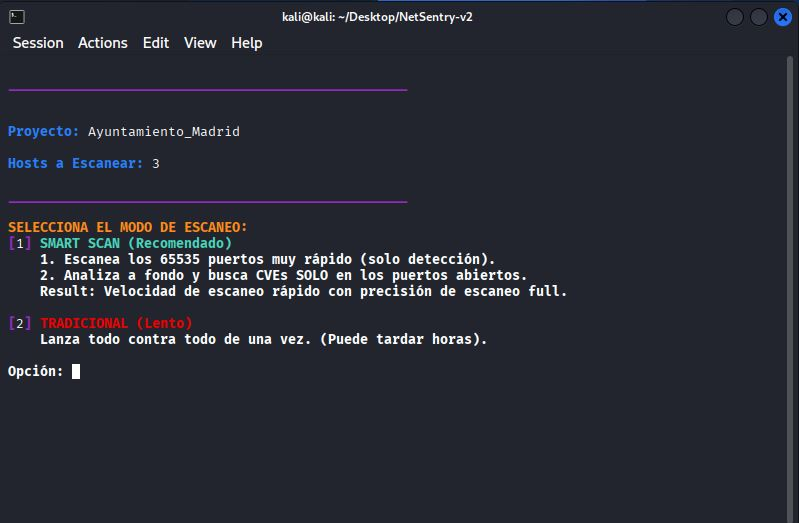

# NetSentry v2.0 - Advanced Network Auditing Framework


**NetSentry** es un framework de auditoría automatizada escrito en Bash que orquesta el poder de **Nmap** y el motor de vulnerabilidades **Vulners**. Diseñado para pentesters y auditores de seguridad, esta herramienta gestiona proyectos (workspaces), automatiza el descubrimiento de hosts y realiza análisis de vulnerabilidades (CVEs) utilizando una lógica de escaneo inteligente de dos fases.

---

## 📋 Tabla de Contenidos
- [Características Principales](#-características-principales)
- [Arquitectura y Lógica Técnica](#-arquitectura-y-lógica-técnica)
    - [Gestión de Workspaces](#1-gestión-de-workspaces)
    - [Descubrimiento de Hosts (Host Discovery)](#2-descubrimiento-de-hosts)
    - [Smart Scan vs Traditional Scan](#3-enumeración-y-vulners-smart-scan-engine)
- [Instalación y Dependencias](#-instalación-y-dependencias)
- [Uso](#-uso)
- [Integración con Dashboard](#-integración-con-dashboard)
- [Disclaimer](#-disclaimer)





---

## 🚀 Características Principales

* **Gestión de Proyectos (Workspaces):** Organiza automáticamente los resultados de cada cliente o auditoría en carpetas aisladas.
* **Cálculo de Red Automático:** Detecta interfaces, calcula rangos CIDR y máscaras de red automáticamente usando `ipcalc`.
* **Salida Multi-formato:** Genera reportes en XML, NMAP y GNMAP compatibles con herramientas de importación.
* **Visualización en Terminal:** Utiliza `miller` (mlr) para presentar tablas de resultados limpias y legibles en la consola.
* **Detección de CVEs:** Integración nativa con el script `vulners` de Nmap para mapear versiones de servicios contra bases de datos de vulnerabilidades públicas.

---

## 🧠 Arquitectura y Lógica Técnica

NetSentry no es solo un lanzador de comandos; implementa lógica para optimizar el tiempo y la precisión de la auditoría.

### 1. Gestión de Workspaces
El script crea una estructura de directorios persistente. Al iniciar, puedes crear un nuevo proyecto o cargar uno existente.
* **Ruta Base:** `./NetSentry_Projects/`
* **Estructura:** `./NetSentry_Projects/<Nombre_Proyecto>/<Archivos_Reporte>`
* **Persistencia:** El archivo `target_ips.txt` se guarda en el proyecto, permitiendo reanudar la auditoría (fase de enumeración) en cualquier momento sin volver a escanear la red.

### 2. Descubrimiento de Hosts
Utiliza técnicas mixtas para evadir firewalls básicos y maximizar la detección en redes locales.
* **Técnica:** `ARP Ping (-PR)` para red local (capa 2, ultra rápido) + `TCP SYN Ping (-PS22,80,443)` para atravesar filtros ICMP.
* **Optimización:**
    * `-n`: Sin resolución DNS (reduce tiempos muertos).
    * `-T4`: Plantilla de temporización agresiva.
* **Parsing:** Procesa la salida Greppable (`.gnmap`) para extraer solo hosts con estado `Up` y ordenarlos numéricamente antes de guardarlos.

### 3. Enumeración y Vulners (Smart Scan Engine)
Aquí reside la mayor optimización técnica del script. Ofrece dos modos:

#### 🟢 Opción 1: Smart Scan (Recomendado)
Resuelve el problema de la lentitud de Nmap cuando se combinan escaneos de todos los puertos con scripts de versiones. Funciona en dos fases:

1.  **Fase de Detección (Fast Phase):**
    * Escanea los **65,535 puertos**.
    * Usa `--min-rate 2000`: Envía paquetes a alta velocidad.
    * **Objetivo:** Solo identificar qué puertos están abiertos (sin analizar servicios).
    * *Resultado:* Se genera una lista limpia de puertos (ej: `22,80,445`).

2.  **Fase de Análisis (Deep Phase):**
    * Lanza Nmap **SOLO** contra los puertos detectados en la Fase 1.
    * Activa detección de versiones (`-sV`), detección de SO (`-O`) y scripts de vulnerabilidad (`--script vulners`).
    * **Ventaja:** Obtienes la profundidad de un escaneo completo en una fracción del tiempo.

#### 🔴 Opción 2: Traditional Scan (Full)
Ejecuta un escaneo monolítico estándar contra todos los puertos. Útil si se sospecha que la velocidad del Smart Scan podría estar perdiendo puertos debido a latencia de red o IDS estrictos.

---

## 🛠 Instalación y Dependencias

NetSentry requiere herramientas específicas para realizar cálculos de red y formateo de tablas.

**1. Clonar el repositorio:**
```bash
git clone https://github.com/CCDani/NetSentry.git
````
```bash
cd NetSentry
```
```bash
chmod +x NetSentry.sh
```


**2. Instalar dependencias (Debian/Ubuntu/Kali):**

```Bash
sudo apt update
```
```Bash
sudo apt install nmap ipcalc miller -y
```

**nmap:** Core del escaneo.


**ipcalc:** Necesario para calcular rangos de red y máscaras.

**miller (mlr):** Opcional (pero recomendado) para visualización de tablas bonitas en terminal.


**3. Actualizar base de datos de scripts de Nmap: Para que la detección de CVEs funcione correctamente:**

```Bash
sudo nmap --script-updatedb
```
## 💻 Uso
El script es interactivo. Simplemente ejecútalo con privilegios de root (necesarios para escaneos SYN y detección de SO).

```Bash
sudo ./netsentry.sh
```

**Selecciona/Crea un Workspace:** Elige un nombre para tu auditoría actual.

Opción 1 (Descubrimiento): Identifica los hosts vivos en tu red o en una IP manual.

Opción 2 (Enumeración): Elige entre "Smart Scan" o "Traditional" para buscar vulnerabilidades en los hosts detectados.


## 📊 Integración con Dashboard
NetSentry genera archivos XML (.xml) estandarizados en la carpeta de tu proyecto. Estos archivos están optimizados para ser importados en herramientas de análisis gráfico.

Para una visualización profesional de los resultados, utiliza el Nmap Dashboard Analyzer:

👉 Repositorio: https://github.com/CCDani/nmap-dashboard-analyzer

Simplemente carga el archivo vuln_report_SMART_xxx.xml generado por NetSentry en el dashboard para ver gráficos de puertos, sistemas operativos y CVEs críticos.

## ⚠️ Disclaimer
Esta herramienta está diseñada únicamente para fines educativos y auditorías de seguridad autorizadas. El uso de este script contra redes o sistemas sin el consentimiento previo y explícito del propietario es ilegal. El autor no se hace responsable del mal uso de esta herramienta.

By Daniel Castellano (CCDani)
